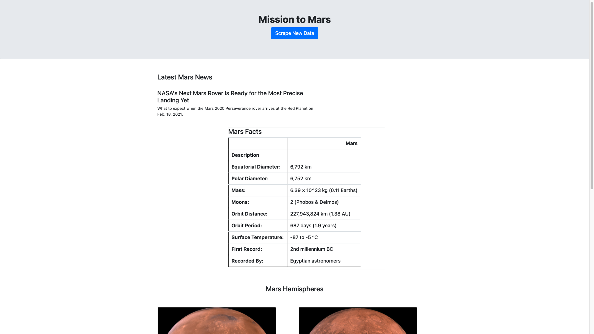
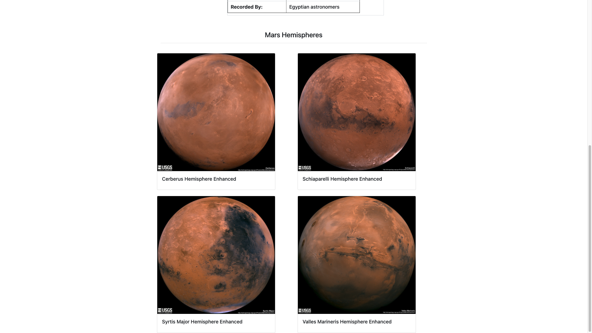

# web-scraping-challenge

In this repository multiple websites were scraped for data. This data was then compiled and rendered into an app to visualize this data on the web.

### NASA Mars News

* Scrape the [NASA Mars News Site](https://mars.nasa.gov/news/) and collect the latest News Title and Paragraph Text. Assign the text to variables that you can reference later.

### Mars Facts

* Visit the Mars Facts webpage [here](https://space-facts.com/mars/) and use Pandas to scrape the table containing facts about the planet including Diameter, Mass, etc.

* Use Pandas to convert the data to a HTML table string.

### Mars Hemispheres

* Visit the USGS Astrogeology site [here](https://astrogeology.usgs.gov/search/results?q=hemisphere+enhanced&k1=target&v1=Mars) to obtain high resolution images for each of Mar's hemispheres.

All the above data from the webscraping was inserted into a python dictionary to be pushed into a mongodb dictionary. 

# Step 2 - MongoDB and Flask Application

Use MongoDB with Flask templating to create a new HTML page that displays all of the information that was scraped from the URLs above.

* Start by converting your Jupyter notebook into a Python script called `scrape_mars.py` with a function called `scrape` that will execute all of your scraping code from above and return one Python dictionary containing all of the scraped data.

* Next, create a route called `/scrape` that will import your `scrape_mars.py` script and call your `scrape` function.

  * Store the return value in Mongo as a Python dictionary.

* Create a root route `/` that will query your Mongo database and pass the mars data into an HTML template to display the data.

* Create a template HTML file called `index.html` that will take the mars data dictionary and display all of the data in the appropriate HTML elements. Use the following as a guide for what the final product should look like, but feel free to create your own design.

